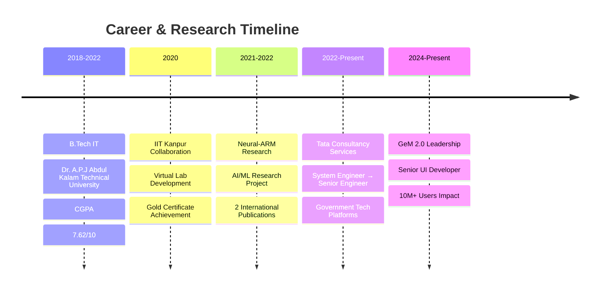

# Hi there! 👋 I'm Pankaj Kumar Gond

<div align="center">
  
[](https://git.io/typing-svg)

</div>


<div align="center">
  
🚀 **Senior System Engineer @ TCS** | 🎓 **AI Research Enthusiast** | 🌟 **Open Source Contributor**

[](https://erpankaj.netlify.app)
[](https://www.linkedin.com/in/pankaj-kumar-gond/)
[](mailto:pankajvk211@gmail.com)
[](https://github.com/pankaj-creator)

</div>

---

## 🔥 About Me

```javascript
const pankaj = {
    location: "New Delhi, India",
    currentRole: "Senior System Engineer",
    company: "Tata Consultancy Services (TCS)",
    experience: "2+ years",
    
    passions: [
        "Building scalable web applications",
        "AI/ML research and development", 
        "Contributing to government tech platforms",
        "Publishing research in international journals"
    ],
    
    currentFocus: [
        "Government e-Marketplace (GeM 2.0) development",
        "React.js & AI/ML integration",
        "CI/CD optimization & cloud technologies"
    ],
    
    funFact: "Published 2 research papers on AI-powered data mining! 📚✨"
};
```

---

## 🛠️ Tech Arsenal

<div align="center">

### 🎨 Frontend Technologies


### ⚙️ Backend & Database


### 🤖 AI/ML & Data Science


### ☁️ DevOps & Cloud


### 🔧 Tools & Development


</div>

---

## 🏆 Achievements & Recognition

<div align="center">

| 🎯 **Professional Awards** | 🔬 **Research Impact** | 🎓 **Certifications** |
|:---:|:---:|:---:|
|  |  |  |
|  |  |  |
|  |  |  |

</div>

---

## 🚀 Featured Projects

<div align="center">

### 🧠 Neural-ARM: AI-Powered Association Rule Mining
[](https://github.com/pankaj-creator/Neural-ARM)

**🔬 Research Impact:** 2 Published Papers | **⚡ Performance:** Significant speed improvement over traditional algorithms
- 🏆 **Innovation:** Novel denoising autoencoder approach for data mining
- 📊 **Publications:** [IJRASET](https://www.ijraset.com/research-paper/association-rule-mining-using-fp-growth) & [River Publishers](https://www.riverpublishers.com/pdf/ebook/chapter/RP_9788770227667C9.pdf)
- 🛠️ **Tech Stack:** Python, TensorFlow, Keras, Neural Networks

### 💼 GeM 2.0 - Government e-Marketplace
[](https://erpankaj.netlify.app)

**🌟 Current Role:** Senior UI Developer | **💰 Scale:** ₹5L+ Cr transactions
- 🚀 **Real-time Notifications:** Built scalable notification system
- ⚙️ **CI/CD Excellence:** 50% deployment time reduction
- 📈 **Reliability:** 99.9% uptime achievement

### 🎓 Virtual Lab Platform - IIT Kanpur
[](https://github.com/Virtual-Lab-Committee)

**🏅 Recognition:** Gold Developer Certificate | **🌍 Impact:** COVID-19 remote education
- 💻 **Interactive Labs:** 3 queue algorithm simulations
- 🎯 **Accessibility:** Enabled remote learning during pandemic

</div>

---

## 📊 GitHub Analytics

<div align="center">


</div>

<div align="center">

[](https://git.io/streak-stats)

</div>

---

## 🔬 Research Publications

<div align="center">

| 📄 **Publication** | 🏛️ **Journal/Publisher** | 📅 **Year** | 🔗 **Link** |
|:---|:---|:---:|:---:|
| Association Rule Mining using FP-Growth and ANN Techniques | IJRASET | 2022 | [](https://www.ijraset.com/research-paper/association-rule-mining-using-fp-growth) |
| Advanced Techniques in Association Rule Mining | River Publishers | 2022 | [](https://www.riverpublishers.com/pdf/ebook/chapter/RP_9788770227667C9.pdf) |

**🎯 Research Focus:** Neural Networks, Data Mining, Machine Learning, AI Algorithms

</div>

---

## 🌟 Professional Journey

<div align="center">



</div>

---

## 🎯 Current Focus & Goals

<div align="center">

### 🚀 2024-2025 Objectives

| 💼 **Professional** | 🔬 **Research** | 🌱 **Learning** |
|:---:|:---:|:---:|
| Lead GeM 2.0 innovation | Continue AI/ML research | Advanced Cloud Architecture |
| Mentor junior developers | Explore generative AI | Microservices patterns |
| Open source contributions | Publish more papers | GraphQL & serverless |

</div>

---

## 💬 Let's Connect & Collaborate!

<div align="center">

**🎯 Open to:** Full-Stack Development Opportunities | AI/ML Research Collaborations | Open Source Projects | Tech Mentoring

### 📫 Reach Out!

[](https://erpankaj.netlify.app)
[](https://www.linkedin.com/in/pankaj-kumar-gond/)
[](mailto:pankajvk211@gmail.com)

</div>

---

<div align="center">
  
### 🌟 "Passionate about crafting exceptional digital experiences while pushing the boundaries of AI research"


**⭐ Star my repositories if you find them helpful!**

</div>

---

<div align="center">
  
*"Code with passion, research with purpose, impact with intention"* 💻✨🚀

</div>
